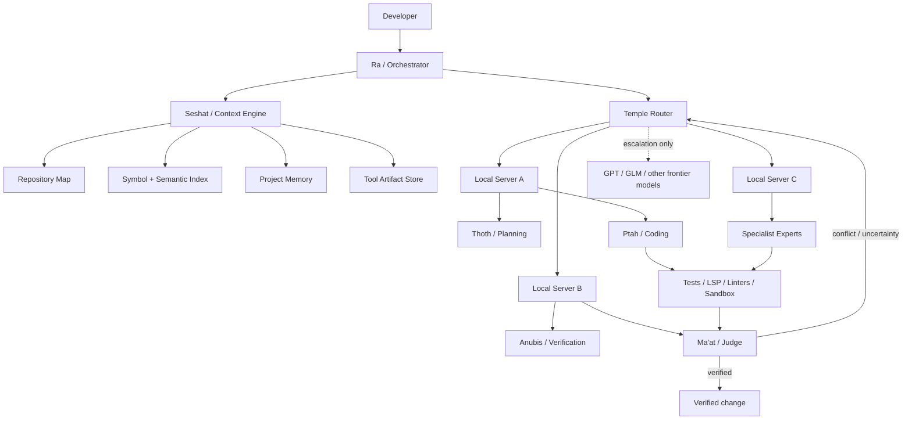

<div align="center">

<pre>
                         ☀
                    ╭─────────╮
               ╭────┤   R A   ├────╮
               │    ╰─────────╯    │
             𓂀│  RELIC AGENT      │𓂀
               │  LOCAL-FIRST AI   │
               ╰───────────────────╯
                         𓋹
</pre>

# RA — Relic Agent

### The local-first coding agent with a council of AI experts.

**Keep routine work inside your own temple. Summon frontier intelligence only when it matters.**

`CLI` · `TUI` · `Local AI` · `Mixture of Agents` · `Worktree Swarms` · `Context Engineering` · `Sandboxing`

</div>

---

## What is RA?

RA is an MIT-licensed terminal coding agent built around a different assumption from most AI coding tools:

> **Your own AI servers should do most of the work. Frontier models should be specialists, not the default workforce.**

RA already has a CLI/TUI, role agents, model fallbacks, Mixture-of-Agents workflows, worktree swarms, sandboxing, local/Ollama support, session history, and verification tooling.

RA v2 turns that foundation into a **model operating system for coding**: several local and remote models can cooperate while RA decides which model gets which job, how much context it receives, when another expert should challenge it, and when a costly frontier model is actually worth calling.

---

## Why RA?

A normal agent often sends the same giant conversation to one expensive model again and again.

RA should instead use a **hierarchy of labor**:

- **Small local models**: repo search, summaries, classifications, test-log analysis, context compression.
- **Strong local coding models**: implementation, refactors, review, routine reasoning.
- **Specialist local models**: vision, security review, embeddings, fast judging.
- **Frontier models**: architecture, ambiguity, deadlocks, high-risk work, and final arbitration.
- **Deterministic tools**: compilers, tests, linters, LSP, Git and sandbox results decide whether the code actually works.

The goal is not merely "cheaper inference."

The goal is **better use of intelligence per token**.

---

# 𓂀 The Temple Architecture



---

# The Pantheon

The Egyptian identity should be memorable without making commands confusing. Every mythological role therefore has a plain functional alias.

| Egyptian role | Functional alias | Responsibility |
|---|---|---|
| **Ra** | Orchestrator | Owns routing, budgets, task graph, escalation and user interaction. |
| **Seshat** | Context Librarian | Builds compact context packets, indexes the repo and maintains memory. |
| **Thoth** | Planner | Architecture, decomposition and reasoning. |
| **Ptah** | Builder | Implementation and code editing. |
| **Anubis** | Verifier | Tests, compilers, lint, runtime failures and debugging. |
| **Ma'at** | Judge | Reviews evidence, weighs expert disagreement and approves completion. |
| **Horus** | Vision Expert | Screenshots, UI inspection and multimodal work. |
| **Sekhmet** | Security Expert | Auth, secrets, dangerous commands, dependency and security review. |
| **Imhotep** | Architecture Expert | Large refactors, migrations, performance and systems design. |

Normal aliases such as `/plan`, `/code`, `/review`, `/test`, `/vision` and `/security` remain available.

---

# Local-first routing

```text
                       ┌─────────────────┐
                       │    User task    │
                       └────────┬────────┘
                                │
                       Seshat assembles
                        context packet
                                │
                    ┌───────────▼───────────┐
                    │     Temple Router      │
                    └───────┬────────┬──────┘
                            │        │
                     routine│        │risky / difficult
                            │        │
                      ┌─────▼────┐   │
                      │ LOCAL AI │   │
                      └─────┬────┘   │
                            │        │
                  deterministic checks
                      │           │
                    pass         fail
                      │           │
                   finish    local repair loop
                                  │
                             still unresolved?
                                  │
                                  └────────────► FRONTIER MODEL
```

Cloud escalation is based on **evidence**, not on vague model confidence.

Possible escalation triggers:

- the same test keeps failing after a configurable number of repair loops;
- expert conclusions conflict materially;
- the patch does not compile;
- the task touches high-risk surfaces such as migrations, authentication, permissions or destructive operations;
- required context exceeds the practical local-server budget;
- the local model repeatedly produces invalid tool calls or stalls;
- the user explicitly requests a frontier model.

---

# Application-level Mixture of Experts

RA's MoE is an **agent/runtime-level mixture of experts**, not a claim that the underlying neural network itself uses an MoE architecture.

```text
                           TASK
                            │
          ┌─────────────────┼─────────────────┐
          │                 │                 │
       Thoth              Ptah             Sekhmet
     architecture      implementation       security
          │                 │                 │
          └─────────────────┼─────────────────┘
                            │
                    deterministic checks
                            │
                          Anubis
                            │
                           Ma'at
                            │
                   disagreement high?
                       │           │
                      no          yes
                       │           │
                    finish       compact
                                evidence
                                  │
                               GPT / GLM
```

The expensive model receives only the **objective, relevant code, diff, failures and unresolved disagreement** instead of the complete raw session.

---

# Seshat: context engineering

A giant context window is useful, but automatically filling it is wasteful.

RA should maintain:

1. **Full history** — persisted locally.
2. **Active context** — a purpose-built packet for the current model call.

```text
L0  Constitution / system rules
L1  Objective + acceptance criteria
L2  Current diff + files being edited
L3  Retrieved symbols, code and tests
L4  Project memory + compact session state
L5  Raw transcript + complete tool logs (stored, not injected by default)
```

Example context packet:

```text
OBJECTIVE
Fix checkout rounding regression.

ACCEPTANCE CRITERIA
- existing tests pass
- values remain integer cents internally

AFFECTED FILES
src/checkout.ts
tests/checkout.test.ts

FAILURE
Expected "$12.50", received "$12.5"

CURRENT DIFF
<small relevant diff>

RELEVANT SYMBOLS
calculateTotal()
formatCurrency()

PROJECT MEMORY
Currency values are represented as integer cents.
```

## Virtualize large tool outputs

```text
tool://sha256/7f2a...  -> complete test output
tool://sha256/a913...  -> compiler diagnostics
```

Agents receive a short local summary by default and can explicitly retrieve the complete artifact.

## Adaptive context profiles

| Profile | Typical active context | Use |
|---|---:|---|
| `fast` | 8K–16K | small fixes, commands, classification |
| `normal` | ~32K | routine coding |
| `deep` | 64K–128K | refactors and architecture |
| `archive` | max practical model limit | exceptional long-context work |

The router should use the **smallest context that reliably solves the task**.

---

# AI-server federation

RA should treat model servers as compute nodes rather than as hard-coded providers.

First-class targets:

- Ollama
- OpenAI-compatible APIs
- llama.cpp server
- vLLM
- SGLang
- LM Studio
- LiteLLM gateways
- remote GPU boxes

At discovery time RA records:

```text
model ID
context window
tool calling
structured output
vision support
reasoning mode
tokens/sec
first-token latency
queue depth
parallel slots
local/LAN/cloud
monetary cost
recent task success rate
```

Example cluster:

```text
temple-p6000
└── Qwen coding worker

temple-mi50-a
├── fast reasoning worker
└── embeddings

temple-mi50-b
├── reviewer
└── test-analysis worker

cloud
├── GPT
└── GLM
```

RA should route based on capability, measured performance, task history, load, context need, privacy and cost.

---

# Outcome-based routing

RA should learn from verification rather than from branding.

```json
{
  "task_type": "typescript-debug",
  "model": "local/qwen",
  "server": "temple-p6000",
  "iterations": 2,
  "tests_passed": true,
  "latency_ms": 18321,
  "cloud_calls": 0
}
```

Over time, the router can prefer the model/server combination that actually produces passing changes for that class of task.

---

# 𓇳 Living TUI

RA should feel like a living Egyptian terminal rather than a themed text box.

The top of the interface contains a **time-aware ASCII horizon** driven by the computer's local clock.

- **05:00–07:29 — Dawn:** sun emerges behind the pyramids, sparse birds, dim stars fading.
- **07:30–16:59 — Day:** bright sun moves across the sky, occasional birds, subtle Nile shimmer.
- **17:00–19:29 — Sunset:** sun descends, horizon shading changes, torches begin appearing.
- **19:30–04:59 — Night:** moon and stars, torch flicker, Nile reflections and occasional shooting star.

The animation is intentionally low-frequency and terminal-safe. It should pause when RA is not focused or when reduced-motion mode is enabled.

```text
╭─ 𓂀 RA / RELIC AGENT ───────────────────────────── 18:42 ─ SUNSET ─╮
│          .       .                    \  |  /                     │
│     .                         .         \ | /                      │
│                     _.._             --- ☀ ---                    │
│          /\        /    \                |                        │
│         /  \      / /\   \        /\                              │
│        /____\    /_/  \___\      /  \          ~ ~ ~ Nile ~ ~   │
│   𓆣      ║          ║          /____\       ≈≈≈≈≈≈≈≈≈≈≈≈≈≈≈    │
╰───────────────────────────────────────────────────────────────────╯
╭─ PAPYRUS ─────────────────────╮╭─ TEMPLE SERVERS ─────────────────╮
│ context        28K / 128K     ││ p6000 / qwen       ● READY      │
│ retrieved      12 files       ││ mi50-a / reviewer   ◐ 61%        │
│ tool cache     23 artifacts   ││ cloud / GPT         ○ SLEEPING   │
│ cloud spend    $0.00          ││ cloud / GLM         ○ SLEEPING   │
╰───────────────────────────────╯╰───────────────────────────────────╯
╭─ COUNCIL ─────────────────────╮╭─ WEIGHING OF MA'AT ──────────────╮
│ Thoth     ✓ plan complete     ││ typecheck          ✓             │
│ Ptah      ● implementing      ││ unit tests         ✓ 182/182     │
│ Anubis    ◐ inspecting tests  ││ lint               ✓             │
│ Ma'at     ○ waiting           ││ security           … pending     │
╰───────────────────────────────╯╰───────────────────────────────────╯
╭─ SCRIBE ───────────────────────────────────────────────────────────╮
│ > refactor auth and keep the API backwards compatible_            │
╰───────────────────────────────────────────────────────────────────╯
```

The scene is not wasted space: it doubles as a status surface.

- sun/moon position = local time;
- tiny scarab animation = an agent is working;
- torch flicker = background local inference is active;
- obelisk glyph = frontier escalation;
- Nile pulse = token streaming;
- stars can represent active model workers;
- a solar eclipse can be reserved for critical errors;
- a balanced `⚖` / Ma'at indicator means verification passed.

Users can choose:

```text
/theme pharaonic
/scene auto
/scene night
/scene minimal
/motion full
/motion reduced
/motion off
```

RA must automatically drop to a compact header when the terminal is too short or too narrow.

---

# ASCII startup animation

Startup should last roughly one second and be skippable on any keypress.

Frame concept:

```text
[1]
                 .
                / \
               /___\

[2]
             \  |  /
              \ | /
           ---- ☀ ----
                |
              /\   /\
             /__\ /__\

[3]
        𓂀   R  E  L  I  C   A  G  E  N  T   𓂀
             /\       /\       /\
            /__\     /__\     /__\
        ≈≈≈≈≈≈≈≈≈≈  N I L E  ≈≈≈≈≈≈≈≈≈≈

[4]
        ───── THE TEMPLE IS AWAKE ─────
```

Other micro-animations:

- rotating Eye of Horus-style spinner;
- walking scarab for tool execution;
- animated scales for review/judging;
- papyrus unrolling when context is compacted;
- opening stone door when a new session begins;
- obelisk lighting when a cloud specialist is summoned.

Animations must never block the agent loop.

---

# Token economy

RA should save tokens structurally:

- local summarization;
- local retrieval;
- local embeddings;
- local repo maps;
- local test analysis;
- local expert debate;
- content-hash caches;
- context packets;
- delta summaries instead of complete re-summaries;
- cloud calls only after evidence-based escalation.

The most valuable token is the token you never send.

---

# Quick start

```bash
git clone https://github.com/zarigata/RA.git
cd RA
./install

export PATH="$HOME/.local/bin:$PATH"

ra doctor
ra
```

Headless:

```bash
ra run "Fix the bug in the price calculator and check edge cases" --quick --verify
```

Mixture of agents:

```bash
ra moa "Review the authentication refactor" \
  --roles thoth,ptah,maat \
  --concurrency 3
```

Worktree swarm:

```bash
ra swarm run tasks.json --concurrency 2
ra swarm status ID
ra swarm apply ID
```

---

# Design principle

RA should not try to win by pretending every task needs the smartest model on Earth.

It should win by knowing:

> **which intelligence to use, what evidence to give it, how much context it needs, and how to verify the answer.**

<div align="center">

`𓂀 local first · evidence first · context with purpose · cloud by exception 𓂀`

</div>
