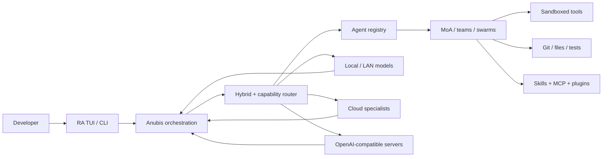

# 𓂀 RA — Relic Agent

<div align="center">

```text
                         ☀
                    .-"""""-.
                 .-'    RA     '-.
               .'   𓂀 RELIC AGENT '.
              /_____________________\
                   /\         /\
                  /  \_______/  \
                 /_______________\

       LOCAL MODELS  ·  CLOUD SPECIALISTS  ·  MANY AGENTS
```

**An Egyptian-themed, local-first coding-agent runtime for orchestrating many models without burning premium tokens on every step.**

`Bun` · `TypeScript` · `Ollama` · `OpenAI-compatible APIs` · `Mixture of Agents` · `TUI`

</div>

---

RA is a terminal coding agent built around a simple idea: **use the cheapest capable intelligence for each job**. Local or LAN models can inspect code, search, summarize, test, critique, and handle routine work; larger cloud models can be reserved for the tasks where they add the most value.

RA already includes an interactive TUI, a 76-agent library, layered Mixture-of-Agents (MoA), hybrid model routing, provider capability routing, sessions, checkpoints, worktree swarms, and command isolation. The roadmap pushes that foundation toward a stronger local AI mesh, semantic agent discovery, richer plugin integration, and a time-aware Egyptian terminal experience.

> RA is under active development. This README separates **shipped**, **partial**, and **planned** work instead of advertising roadmap ideas as finished features.

## Status legend

| Mark | Meaning |
|---|---|
| ✅ | Implemented in the repository |
| ⚠️ | Implemented, but still has platform/provider/UX limitations |
| 📋 | Planned; do not treat as shipped |

## What is here today

| Capability | Status | Notes |
|---|---:|---|
| Interactive RA TUI and headless CLI | ✅ | `ra`, `ra run`, palette, sessions, history, replay |
| 76 visible agents + hidden system roles | ✅ | Egyptian core roles plus specialist agents |
| Layered Mixture-of-Agents | ✅ | Cross-model proposals, critics, synthesis, budgets |
| Hybrid local/cloud routing | ✅ | Local-first, quality-first, balanced, economy modes |
| Provider Mosaic / capability routing | ✅ | Multiple Ollama/OpenAI-compatible/provider profiles |
| Checkpoints and undo | ✅ | File-edit checkpoints and recovery commands |
| Git worktree swarms | ✅ | Parallel isolated task branches with explicit apply |
| Command sandboxing | ⚠️ | Strongest on macOS; not a VM/security certification |
| Local/LAN model-first workflow | ✅ | Designed to spend cloud tokens selectively |
| Semantic agent/plugin search | 📋 | Planned discovery layer over agents, skills, tools, plugins |
| Caveman/Ponytail-style plugin hardening | 📋 | Research/integration target, not currently bundled |
| Time-aware Egyptian animated TUI | 📋 | Dawn/day/sunset/night scenes and ASCII transitions |
| Multi-node GPU scheduler | 📋 | Future local AI cluster orchestration |

## Quick start

### Requirements

- Git
- [Bun](https://bun.sh/)
- At least one configured model endpoint if you want live AI calls

```bash
git clone https://github.com/zarigata/RA.git
cd RA
./install
export PATH="$HOME/.local/bin:$PATH"
ra --version
ra help
```

Start the interactive interface:

```bash
ra
```

Or run a task headlessly:

```bash
ra run "Inspect this project, find the bug, fix it, and verify the result" --quick --verify
```

For cloud models, keep credentials in your shell or an untracked environment file. Never commit provider keys.

## The idea: a local AI workshop, not one giant model



The target architecture is deliberately asymmetric:

- **Local models do the volume work** — repo reading, search, test analysis, summaries, routine coding, critics, context compression.
- **Large/SOTA models do the leverage work** — difficult architecture, hard debugging, final synthesis, or specialized reasoning when routing says it is worth the cost.
- **MoA adds diversity** — multiple agents/models can propose or critique instead of trusting a single response.
- **RA owns context** — the long-term goal is to feed each model only the slice of repository/session state it actually needs.

See [`docs/ARCHITECTURE.md`](docs/ARCHITECTURE.md) for component boundaries and [`PLAN.md`](PLAN.md) for the implementation roadmap.

## Egyptian agent system

The core roles are themed around Egyptian mythology but have concrete engineering responsibilities:

| Role | Function |
|---|---|
| **Thoth** | planning, decomposition, reasoning |
| **Ptah** | implementation and construction |
| **Ma'at** | diagnosis, verification, correctness |
| **Sekhmet** | adversarial review and attack testing |
| **Isis** | research and information gathering |
| **Seshat** | documentation and structured knowledge |
| **Horus** | fast/small tasks |
| **Anubis** | orchestration and routing |

RA also ships dozens of practical specialists such as test writers, CI fixers, database engineers, security reviewers, release managers, and documentation agents.

```bash
ra agents
ra agents new my-agent
ra moa "Review this architecture and surface disagreements"
ra moa "Design a safer migration" --roles thoth,maat,sekhmet --concurrency 3
```

Full catalog: [`docs/AGENTS-CATALOG.md`](docs/AGENTS-CATALOG.md).

## Model and provider routing

RA is not tied to one model vendor. The runtime supports local/LAN Ollama workflows and provider abstractions for cloud or OpenAI-compatible endpoints. The capability router can use model/provider profiles, health, latency, quota state, and routing mode to decide where work goes.

Useful commands:

```bash
ra providers
ra models
ra lanes
ra ping
ra env
ra doctor
```

Typical design intent:

```text
cheap/local reasoning ──► code search ──► tests ──► critique
          │                                  │
          └────── difficult/high-value ──────┴──► SOTA/cloud model
```

The exact model names and availability are configuration-dependent and can change over time. See [`anubis/docs/PROVIDERS.md`](anubis/docs/PROVIDERS.md).

## Everyday commands

| Goal | Command |
|---|---|
| Open TUI | `ra` |
| Fast pipeline | `ra run "task" --quick` |
| Full pipeline | `ra run "task"` |
| Verify produced artifacts | `ra run "task" --verify` |
| Machine-readable run | `ra run "task" --json` |
| Inspect last run | `ra last --json` |
| Show files/timings | `ra files`, `ra timings` |
| Undo latest checkpoint | `ra undo` |
| List sessions | `ra sessions` |
| Export transcript | `ra export --out session.md` |
| Agent catalog | `ra agents` |
| Mixture of Agents | `ra moa "task"` |
| Worktree team | `ra swarm ...` |
| Sandbox status | `ra sandbox status` |
| Health check | `ra doctor` |

Run `ra help` for the authoritative command list for your checkout.

## TUI direction

The current TUI already provides the coding workspace, streaming conversation, palettes, themes, session controls, model information, and agent visibility.

The next visual layer is intentionally more distinctive: an **Egyptian terminal that reacts to local time**. Planned scenes include dawn, daylight, sunset, and night; the sun/moon position, pyramids, stars, Eye of Ra, torches, and subtle ASCII transitions become ambient state rather than decoration that blocks work.

```text
DAWN                 DAY                  SUNSET               NIGHT
   \  |  /               ☀                    \ ☀                ·  ✦
 --  ☀  --           𓂀  /\  𓂀              /\ \              ☾    ·
    / \              /\/  \/\             /  \              /\  𓂀
___/___\___       __/________\__       ___/____\___       ___/______\___
```

That experience is **planned**, while the current TUI remains the functional baseline.

## Repository map

```text
RA/
├── ra/                     # Primary RA runtime and TUI
│   ├── src/cli.ts          # Real CLI entrypoint
│   └── tests/              # Runtime tests
├── anubis/                 # Orchestration/core services
│   ├── src/                # routing, providers, sandbox, MoA, sessions...
│   ├── tests/              # core tests
│   └── bun.lock            # reproducible Bun dependency lock
├── docs/                   # user/agent/architecture documentation
├── pkgs/opencode/          # inherited/reference agent assets
├── .github/workflows/      # CI
├── install                 # local launcher installer
├── PLAN.md                 # executable roadmap
└── README.md
```

`ra/src/cli.ts` is the primary CLI. `anubis/src/cli/main.ts` remains a compatibility launcher into that runtime.

## Development and release gate

Install dependencies:

```bash
cd anubis
bun install --frozen-lockfile
cd ..
```

Run the same offline release verification used by CI:

```bash
bash scripts/verify-release.sh
```

The gate is intended to prove four separate things before a GitHub merge:

1. the curated offline unit tests pass;
2. the real RA CLI compiles into a standalone Bun executable;
3. CLI/install smoke checks succeed without needing a live LLM;
4. tracked build junk, secrets, caches, and generated artifacts are rejected.

Live provider/LAN acceptance remains a separate test class because GitHub-hosted runners cannot reach a private Ollama server.

## Safety and trust boundaries

RA can execute commands and edit files. Treat it like any powerful development tool:

- review changes before merging;
- keep API keys out of Git;
- use the sandbox where supported;
- keep important work committed before autonomous runs;
- do not treat worktree isolation as OS-level security;
- do not assume an AI-generated “tests passed” statement is proof — run the project tests yourself.

The existing sandbox has platform limitations and is **not** a hostile-code VM or security certification. See [`ra tests/SAFETY_RESULTS.md`](ra%20tests/SAFETY_RESULTS.md) for measured coverage and limitations.

## Roadmap

The short version:

```text
Release gate
    ↓
Local AI mesh + provider preflight
    ↓
Token-saving context / delegation
    ↓
Semantic agent + skill + plugin search
    ↓
Plugin hardening / capability packs
    ↓
Time-aware Egyptian TUI
    ↓
Multi-GPU / multi-node orchestration
```

The detailed, testable roadmap is in [`PLAN.md`](PLAN.md).

## License and attribution

MIT licensed. Inspired by the broader coding-agent ecosystem, including [OpenCode](https://github.com/anomalyco/opencode). Existing attribution is preserved in [`NOTICE`](NOTICE).

---

<div align="center">

**𓂀 Build with the small models. Summon the gods only when the problem deserves them.**

</div>
