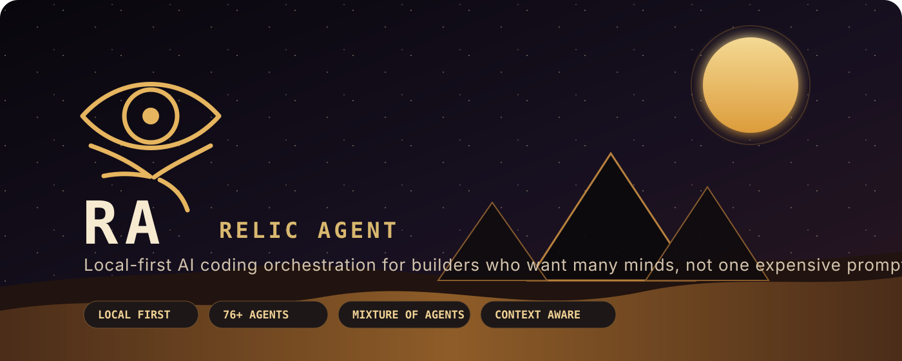
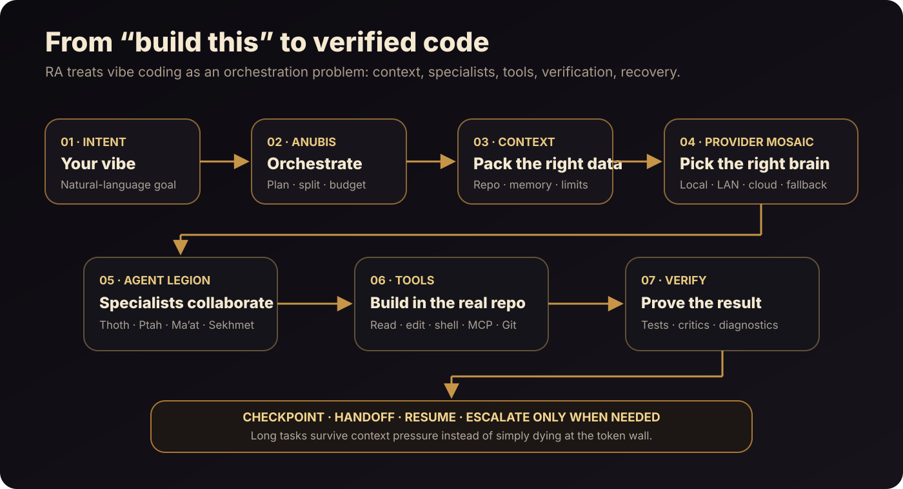
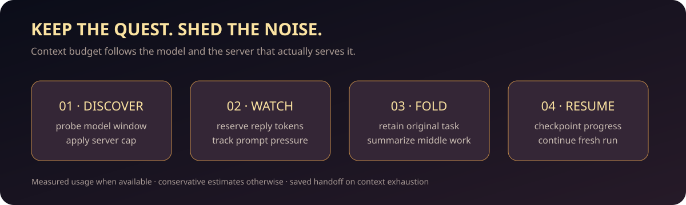

<div align="center">



<br>

[](LICENSE)
[](https://bun.sh/)
[](https://www.typescriptlang.org/)


### Describe the program. Let RA assemble the minds, tools, context, and verification needed to build it.

**RA is a local-first, provider-agnostic AI coding runtime built for serious vibe coding.**  
It can use small local models for high-volume work, larger cloud models for hard problems, specialist agents for different engineering roles, and checkpoints/tests to keep autonomous work recoverable.

[Quick start](#quick-start) · [Why RA](#why-ra) · [Architecture](#how-ra-thinks) · [Agents](#the-egyptian-agent-legion) · [Models](#use-the-right-model-for-the-right-job) · [Roadmap](#where-ra-is-going)

</div>

---

## Vibe coding should be more than one giant chat

Most AI coding workflows eventually hit the same walls:

- the expensive model gets used for everything, including boring work;
- long sessions accumulate junk context until quality collapses;
- one model plans, codes, reviews, and judges its own work;
- provider limits or context overflow can kill a long run;
- autonomous edits are difficult to inspect or recover;
- local GPUs sit idle while cloud tokens get burned;
- adding more agents often means adding more prompt bloat.

RA is being built around a different assumption:

> **The best coding system is not necessarily the single best model. It is the system that can assemble the right context, route work to the right intelligence, verify the result, and recover when something fails.**

That is the core of RA.

## Why RA

RA is not trying to be another thin wrapper around an LLM API. It is an orchestration layer for turning a human goal into verified work.

| Problem | RA's approach |
|---|---|
| Premium tokens disappear fast | Local/LAN models handle routine work; premium models are escalation targets |
| Small models choke on giant contexts | Adaptive context limits, pressure tracking, handoff packets, and fresh-run continuation |
| One model can confidently miss things | Mixture-of-Agents, critics, specialist roles, and independent worktree teams |
| Providers fail or rate-limit | Provider Mosaic, explicit fallback chains, health/capability-aware routing |
| Autonomous changes feel risky | Checkpoints, undo, diffs, permissions, Git isolation, verification |
| Huge agent catalogs bloat prompts | Scoped agents today; semantic capability discovery is the next step |
| You own multiple GPUs/servers | RA is designed around local/LAN endpoints, with a multi-node AI mesh as the north star |

### The goal

RA should let you say things like:

~~~text
Build a production-ready dashboard for this API.
Use the existing design language.
Do not break the current authentication flow.
Run the tests, fix what fails, and explain the architecture when you finish.
~~~

…and let the runtime decide which agent should plan, which model should implement, which reviewer should attack the result, when to use your local GPU, and when a harder cloud model is actually worth the tokens.



## See RA in motion

The terminal has a searchable command and agent palette, streaming replies, a live activity indicator, and a local-time sky that changes from dawn to night. The scene animates gently while you work and leaves room for the editor on smaller screens.

```text
 𓃡 RA  ·  pharaonic  ·  small local · big cloud
 ☾ NIGHT  𓂀  23:14 · ✦ · ✧ · ✦

  You: inspect the failing tests, fix the parser, then verify.
  RA: reading the parser and its tests…
  Ptah: changed src/parser.ts · Maat: reviewing the diff

 ╭ RA › type / to search everything · ? for shortcuts ─────╮
 │ _                                                       │
 ╰─────────────────────────────────────────────────────────╯
```

*Illustrative transcript; available agents and models depend on your configuration.*

### Context that survives long work



RA probes model context where supported, applies a serving-host cap, reserves reply space, and watches prompt pressure. At the low watermark it can summarize older exchanges while keeping the original task and the newest exchange. At critical pressure or a provider overflow it saves a handoff and starts a fresh continuation, within the configured resume limit. A server's advertised window does **not** guarantee the VRAM needed to use it. Configure `context.server_cap` to match the actual server allocation.

```jsonc
{
  "context": {
    "adaptive": true,
    "server_cap": { "ollama-lan": 32768 },
    "low_watermark": 0.7,
    "critical_watermark": 0.9,
    "resume_limit": 3
  }
}
```

Compaction and continuation depend on the configured models responding successfully; an exhausted resume budget returns a partial result and the saved handoff path.

## What already ships

RA is under active development, but the core runtime is real. The current repository includes:

| Capability | Status | What it means |
|---|:---:|---|
| Full-screen interactive TUI + headless CLI | ✅ | Work interactively with <code>ra</code> or automate with <code>ra run</code> |
| 76 visible specialist agents | ✅ | Core Egyptian roles plus engineering specialists |
| Layered Mixture-of-Agents | ✅ | Multiple proposals, critics, synthesis, agreement/disagreement |
| Provider Mosaic | ✅ | Capability-aware routing across local, LAN, cloud, and compatible endpoints |
| Hybrid routing modes | ✅ | <code>local-first</code>, <code>quality-first</code>, <code>balanced</code>, <code>economy</code> |
| Low-context runtime | ✅ | Model context registry, pressure thresholds, handoffs, continuation, escalation |
| Native Ollama context control | ✅ | Sends <code>num_ctx</code> instead of assuming the server reserved the requested window |
| Sessions + replay | ✅ | Persistent work across terminal sessions |
| Checkpoints + undo + diff | ✅ | Recover edits instead of treating every autonomous write as irreversible |
| Git worktree swarms | ✅ | Parallel isolated implementation tasks before explicit integration |
| MCP + skills + plugins | ✅ | Extensible tools and capability surfaces |
| Local/LAN + OpenAI-compatible endpoints | ✅ | Ollama, LM Studio/llama.cpp-compatible servers, cloud providers |
| Air-gapped mode | ✅ | Local-only operation path |
| Command sandboxing | ⚠️ | Useful boundary with platform limitations; not a hostile-code VM |
| Semantic capability search | 📋 | Planned: retrieve only the agents/tools/plugins needed for the task |
| Multi-node GPU scheduler | 📋 | Planned: treat multiple AI servers as one local compute fabric |
| Time-aware Egyptian ambient TUI | ✅ | Dawn/day/sunset/night scene in the full-screen terminal, with a subtle idle animation |

**Legend:** ✅ shipped · ⚠️ shipped with limitations · 📋 planned

For the running engineering truth, see [STATUS.md](STATUS.md), [ROADMAP.md](ROADMAP.md), and [docs/ARCHITECTURE.md](docs/ARCHITECTURE.md).

## The idea in one sentence

### Use cheap intelligence for volume. Use expensive intelligence for leverage.

A normal AI coding client tends to behave like this:

~~~text
every task ─────────────────────────────► biggest model
                                           $$$$$$$$$
~~~

RA is designed to behave more like this:

~~~text
repo scan ───────► local model
summaries ───────► local model
tests ───────────► local model
routine fixes ───► local / cheap model
critics ─────────► local / mixed models

hard architecture ─┐
deep debugging ────┼────────► stronger model only when needed
final synthesis ───┘
~~~

The point is not “local at all costs.” The point is **capability per token, per second, per task**.

## How RA thinks

RA splits a coding request into responsibilities instead of asking one model to do everything.

~~~mermaid
flowchart TB
    U[Developer intent] --> A[Anubis orchestration]
    A --> C[Context + project memory]
    C --> R[Provider Mosaic / capability router]

    R --> L[Local / LAN models]
    R --> P[OpenAI-compatible endpoints]
    R --> X[Cloud / premium models]

    A --> G[Agent registry]
    G --> T[Thoth · plan]
    G --> B[Ptah · build]
    G --> M[Ma'at · verify]
    G --> S[Sekhmet · attack]
    G --> I[Isis · research]
    G --> D[Seshat · document]

    T --> TOOL[Files · shell · search · MCP · skills · Git]
    B --> TOOL
    M --> TOOL
    S --> TOOL

    TOOL --> V[Tests / diagnostics / review]
    V --> H[Checkpoint + handoff + session state]
    H --> A
~~~

The orchestration is deliberately asymmetric. A 9B or 20B local model does not need to beat a frontier model at everything to be useful. It only needs to be good enough at the specific work RA gives it.

## The low-context runtime

Long autonomous coding sessions fail in an ugly way when the runtime pretends every model has unlimited usable context.

RA now treats context as a constrained resource.

The runtime can resolve a model's usable window from configuration, live information, static knowledge, and server caps. It also tracks prompt pressure during a run.

~~~text
0% ───────────────── 70% ───────────── 90% ───────────── 100%
      normal work      wrap-up mode      checkpoint +        overflow
                                        handoff/resume
~~~

At high pressure RA can:

1. restate the original objective;
2. stop spawning unnecessary subagents;
3. finish only the most important remaining steps;
4. checkpoint a compact handoff packet;
5. resume in a fresh, shorter run;
6. escalate to a larger-context model only when policy allows it.

This is especially important for local models, where “advertised context” and “context your server actually allocated” are often two different numbers.

Use:

~~~bash
ra doctor
ra providers
ra eval --model <model>
~~~

to inspect model and context behavior.

## The Egyptian agent legion

The mythology is visual identity; the roles are engineering boundaries.

| Agent | Engineering role |
|---|---|
| **Anubis** | orchestration, routing, task decomposition |
| **Thoth** | architecture, planning, reasoning |
| **Ptah** | implementation and construction |
| **Ma'at** | correctness, diagnostics, verification |
| **Sekhmet** | adversarial review, security, break-it thinking |
| **Isis** | research and evidence gathering |
| **Seshat** | documentation and structured knowledge |
| **Horus** | fast, cheap, lightweight tasks |

RA also carries specialists for testing, databases, CI, security, refactoring, releases, documentation, and other engineering jobs.

Useful commands:

~~~bash
ra agents
ra agents new my-agent
ra moa "Review this architecture and surface disagreements"
ra moa "Design a safer migration" --roles thoth,maat,sekhmet --concurrency 3
~~~

See [docs/AGENTS-CATALOG.md](docs/AGENTS-CATALOG.md) for the catalog.

## Mixture-of-Agents: don't let one model grade itself

For difficult tasks, RA can ask several models or agents for independent proposals, then use critics and a synthesis stage.

~~~text
                    ┌─► proposal A ─┐
task ─► orchestrate ┼─► proposal B ─┼─► critics ─► synthesis ─► action
                    └─► proposal C ─┘
~~~

This matters because model diversity can expose disagreement that a single-agent loop would hide.

Use MoA for architecture decisions, risky migrations, security reviews, difficult debugging, or anything where “first answer wins” is a bad policy.

## Swarms: parallel coding without trampling the same tree

RA can use Git worktrees to isolate parallel implementation attempts or task branches.

A swarm can explore several solutions without letting every agent write into the same working directory. Integration stays explicit.

That makes RA suitable for workflows like:

~~~text
Agent A ─► frontend implementation ─┐
Agent B ─► API implementation ──────┼─► review/apply
Agent C ─► tests + edge cases ──────┘
~~~

Git remains the recovery boundary. RA's sandbox and permissions are additional defenses, not replacements for source control.

## Use the right model for the right job

RA is provider-agnostic. The repository already has paths for:

- local Ollama;
- remote/LAN Ollama;
- LM Studio and llama.cpp-compatible servers;
- Ollama Cloud;
- OpenAI-compatible endpoints;
- provider configurations for commercial APIs.

A practical RA deployment can look like this:

~~~text
                     ┌──────────────────────────────┐
Mac / workstation ──►│ RA                           │
                     │                              │
                     │  fast/meta ─► local 9B/20B  │
                     │  planning ───► LAN 20B/30B  │
                     │  coding ─────► LAN or cloud │
                     │  critic ─────► second model │
                     └──────────────────────────────┘
                               │
                  ┌────────────┴────────────┐
                  ▼                         ▼
          GPU server / Ollama       premium/SOTA API
~~~

The built-in routing modes are:

~~~bash
RA_ROUTING=local-first
RA_ROUTING=quality-first
RA_ROUTING=balanced
RA_ROUTING=economy
~~~

The current example environment supports endpoints such as:

~~~bash
OLLAMA_LAN_URL=http://192.168.1.251:11434
OLLAMA_LOCAL_URL=http://localhost:11434
LM_STUDIO_URL=http://localhost:1234
LLAMACPP_URL=http://localhost:8080
~~~

Do not copy the repository's example LAN address blindly; point RA at your own host.

See [anubis/docs/PROVIDERS.md](anubis/docs/PROVIDERS.md) for provider configuration.

## Quick start

### Requirements

- Git
- [Bun](https://bun.sh/)
- at least one model endpoint for live AI work

### Install

~~~bash
git clone https://github.com/zarigata/RA.git
cd RA

./install
export PATH="$HOME/.local/bin:$PATH"

ra --version
ra doctor
~~~

Launch the interactive workspace:

~~~bash
ra
~~~

Or run a task headlessly:

~~~bash
ra run "Inspect this repository, find the bug, fix it, and verify the result" --quick --verify
~~~

Run the release gate:

~~~bash
bash scripts/verify-release.sh
~~~

## A good first RA setup

If you have one local GPU and access to a stronger cloud model, a sensible philosophy is:

| Work type | Suggested lane |
|---|---|
| Repo exploration | local |
| Summaries / context compression | local |
| Basic plans | local/LAN |
| Tests and diagnostics | local/LAN |
| Routine implementation | local/LAN |
| Hard implementation | stronger LAN/cloud |
| Adversarial review | different model from implementer |
| Final synthesis | strongest model when justified |

This is not a hardcoded rule. It is the mental model RA's router is built to support.

## Everyday commands

| Goal | Command |
|---|---|
| Open TUI | <code>ra</code> |
| Fast coding run | <code>ra run "task" --quick</code> |
| Full run | <code>ra run "task"</code> |
| Verify artifacts | <code>ra run "task" --verify</code> |
| Machine-readable output | <code>ra run "task" --json</code> |
| Inspect last run | <code>ra last --json</code> |
| View files/timings | <code>ra files</code>, <code>ra timings</code> |
| Undo latest checkpoint | <code>ra undo</code> |
| List sessions | <code>ra sessions</code> |
| Export transcript | <code>ra export --out session.md</code> |
| Inspect agents | <code>ra agents</code> |
| Run Mixture-of-Agents | <code>ra moa "task"</code> |
| Inspect providers | <code>ra providers</code> |
| Inspect model lanes | <code>ra lanes</code> |
| Health/context diagnostics | <code>ra doctor</code> |
| Sandbox status | <code>ra sandbox status</code> |

Run <code>ra help</code> for the command surface in your checkout.

## Built for vibe coders, not only AI researchers

RA should feel useful even if you do not want to spend your day hand-tuning prompts.

The intended UX is:

**say what you want → inspect the plan when needed → let the runtime do the routing → review the diff → keep or undo the result.**

The complexity belongs inside RA:

- provider discovery;
- model health;
- context limits;
- fallback chains;
- agent selection;
- task boundaries;
- token budgets;
- checkpoints;
- verification.

The user should not need to become a distributed-systems engineer just to ask an AI to build an app.

## Trust, recovery, and safety

RA can execute commands and modify files. Treat it like a powerful development tool, not a magic sandbox.

Recommended practice:

1. start important autonomous work from a clean Git state;
2. keep API keys outside Git;
3. review diffs before merging;
4. use RA's permissions and sandbox where supported;
5. use worktrees for parallel autonomous work;
6. run project tests yourself for high-stakes changes;
7. do not treat an AI-generated “tests passed” sentence as evidence by itself.

The command sandbox has platform limitations and is **not** a hostile-code VM or a formal security certification.

Measured safety work lives in [ra tests/SAFETY_RESULTS.md](ra%20tests/SAFETY_RESULTS.md).

## Benchmarks: evidence, not mythology

The repository includes competitive and installed-user test evidence under <code>ra tests/</code>.

Those results are useful for regression testing and design decisions, but they are **point-in-time measurements on specific tasks, models, hardware, and provider conditions**. They should not be read as a universal claim that RA beats every coding tool on every repository.

That distinction matters. RA should earn its reputation through reproducible results, not README bravado.

## Repository map

~~~text
RA/
├── ra/                         # primary runtime, CLI, TUI
│   ├── src/cli.ts              # public RA entrypoint
│   └── tests/                  # runtime tests
├── anubis/                     # orchestration + provider engine
│   ├── src/                    # routing, providers, context, MoA, sessions...
│   ├── docs/                   # provider/config docs
│   └── ra.json                 # example/default routing profile
├── docs/
│   ├── ARCHITECTURE.md         # architecture and north star
│   ├── AGENTS-CATALOG.md       # agent catalog
│   └── assets/                 # README/brand visuals
├── benchmarks/                 # evaluation assets
├── scripts/                    # verification/release tooling
├── ra tests/                   # installed-user / competitive / safety evidence
├── STATUS.md                   # current engineering state
├── ROADMAP.md                  # persistent backlog
├── PLAN.md                     # implementation plan
└── README.md
~~~

## Where RA is going

The end state is bigger than a single-machine coding CLI.

~~~text
                         RA
                          │
                 intent + repository
                          │
                capability discovery
                          │
          ┌───────────────┴────────────────┐
          │                                │
   LOCAL AI MESH                    CLOUD SPECIALISTS
          │                                │
  ┌───────┼────────┐                       │
  │       │        │                       │
GPU A   GPU B   workstation          frontier models
  │       │        │                       │
  └───────┴────────┴──────────┬────────────┘
                              │
                   agents / MoA / swarms
                              │
                    tools + verification
                              │
                    checkpointed result
~~~

The major direction is:

1. **smarter context retrieval** — retrieve symbols/chunks instead of dumping repositories;
2. **semantic capability discovery** — search the agent/tool/plugin registry instead of loading everything;
3. **persistent project intelligence** — compact, attributable memory across long work;
4. **local AI mesh** — multiple GPUs and servers scored by capability, latency, context, and cost;
5. **stronger plugin contracts** — explicit filesystem/network/process/secrets capabilities;
6. **distinctive Egyptian TUI** — time-aware dawn/day/sunset/night scenes around a serious coding workspace.

Read [docs/ARCHITECTURE.md](docs/ARCHITECTURE.md) and [PLAN.md](PLAN.md) for the deeper design.

## Contributing

RA benefits most from contributions that improve one of four things:

- **reliability** — better tests, recovery, provider behavior;
- **intelligence** — routing, context, agent/tool selection;
- **local AI** — Ollama/vLLM/LM Studio/llama.cpp and multi-GPU workflows;
- **UX** — make advanced orchestration feel simple.

Before changing behavior, run the repository verification gate and keep shipped/planned claims honest.

## License

MIT. See [LICENSE](LICENSE).

RA is inspired by the wider coding-agent ecosystem, including [OpenCode](https://github.com/anomalyco/opencode). Existing attribution is preserved in [NOTICE](NOTICE).

---

<div align="center">

### 𓂀 Build with the small models. Summon the gods only when the problem deserves them.

**Local first. Many minds. Recoverable work.**

</div>
