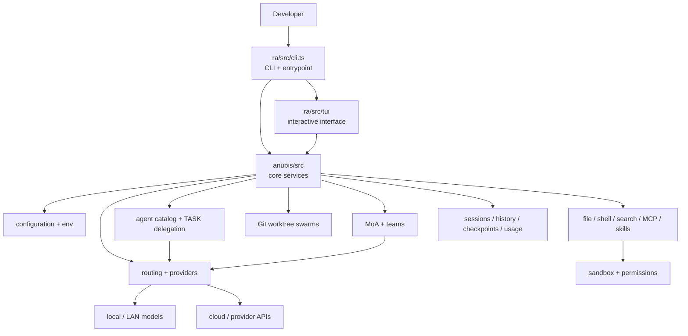
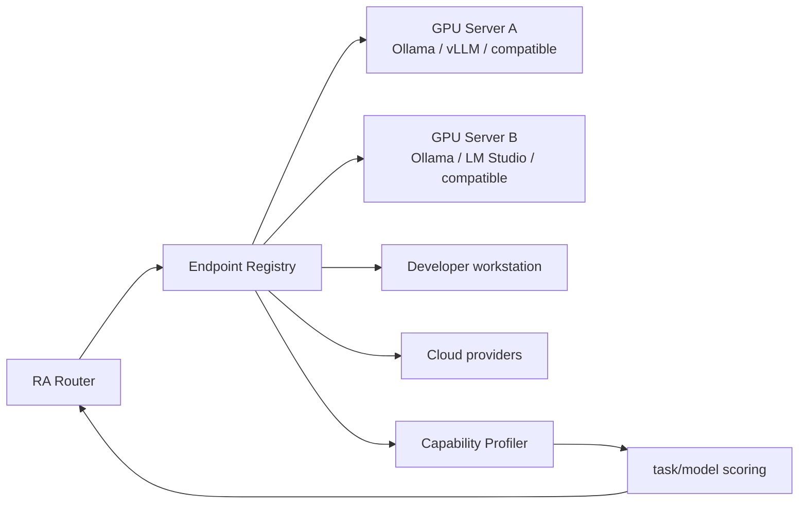
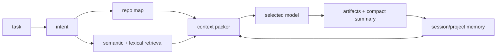

# RA Architecture

This document describes **what RA is now**, where the important boundaries are, and the architecture RA is moving toward. Planned components are explicitly marked so the design does not get confused with shipped behavior.

## 1. North star

RA is a **local-first, provider-agnostic coding-agent runtime**. Its job is not to send every token to the biggest model available. Its job is to assemble the right context, choose the right specialist, run work inside explicit boundaries, verify the result, and escalate to expensive intelligence only when the task deserves it.

The design is guided by five principles:

1. **Local compute first.** Routine reasoning, search, summaries, testing, and critics should run on local/LAN hardware when capable.
2. **Cloud for leverage.** Strong cloud/SOTA models are specialists and escalation targets, not the default tax on every turn.
3. **Many experts beat one prompt.** Agent roles, MoA, critics, and worktree teams make disagreement visible and let RA synthesize evidence.
4. **Context is a resource.** Repository state should be retrieved and packed deliberately instead of repeatedly dumping the whole project into a model.
5. **Execution must be observable.** Model selection, fallbacks, edits, commands, tests, budgets, and failures should be visible and attributable.

## 2. Current high-level architecture



### Primary runtime

`ra/src/cli.ts` is the primary RA command-line entrypoint. It owns the public command surface and connects the newer RA runtime to the core modules in `anubis/src`.

`anubis/src/cli/main.ts` remains a compatibility launcher. It forwards arguments to `ra/src/cli.ts` and establishes the runtime paths expected by older Anubis components.

### Core services

`anubis/src` contains the mature service layer used by the RA runtime: model/provider access, routing, configuration, sessions, usage accounting, orchestration, MoA pieces, sandbox helpers, and related infrastructure.

### UI

`ra/src/tui` is the interactive terminal surface. The TUI should remain a client of the runtime rather than becoming the place where orchestration logic is hidden. Headless commands must continue to work without a terminal UI.

### State

Persistent user/session state belongs outside tracked source wherever possible. Project-scoped RA state uses ignored `.ra/` paths; user-scoped state lives under `~/.ra/`. Git remains the source of truth for project changes.

## 3. Request lifecycle today

A typical coding request follows this shape:

```text
user request
    │
    ▼
CLI/TUI parses intent and project context
    │
    ▼
Anubis selects pipeline / role / model lane
    │
    ├── local or LAN endpoint
    ├── cloud/provider endpoint
    └── fallback / escalation when permitted
    │
    ▼
agent receives bounded context + tools
    │
    ▼
read/search → reason → edit/command → verify
    │
    ▼
checkpoint/history/usage/result persisted
```

For multi-agent work, the path can branch into independent proposals, critics, synthesis, or Git worktree tasks before returning a combined result.

## 4. Model and provider layer

### Shipped

RA can route across multiple configured model endpoints instead of binding the project to one vendor. Current routing concepts include local/LAN versus cloud lanes, capability profiles, provider health, fallback chains, latency/cost signals, and budget-aware decisions.

A provider failure should be **observable**. Silent migration between trust boundaries is discouraged; explicit configured fallbacks are preferred.

### Target: Local AI Mesh 📋

The next model layer should turn several GPUs/servers into a coherent pool:



Planned endpoint metadata:

- model IDs and aliases;
- context window and supported modalities;
- measured latency and throughput;
- available VRAM / loading state where the engine exposes it;
- cost class (`local`, `metered`, `premium`);
- capability scores such as code, research, review, vision, long-context, and fast-chat;
- recent failures, rate limits, and cooldowns;
- warm/cold state and optional pre-warming policy.

The scheduler should prefer **measured capability per cost**, not model prestige.

## 5. Agent architecture

### Shipped

RA has an agent catalog with Egyptian core roles plus pragmatic specialists. Agents are permission-scoped and can be selected directly or delegated through TASK-style orchestration. MoA and team flows let multiple agents/models produce independent evidence before synthesis.

Core mythology maps to engineering responsibility, not decorative personas:

- **Thoth** — architecture, planning, decomposition;
- **Ptah** — implementation;
- **Ma'at** — verification and correctness;
- **Sekhmet** — adversarial/security critique;
- **Isis** — research;
- **Seshat** — documentation/knowledge;
- **Horus** — fast tasks;
- **Anubis** — orchestration and routing.

### Target: semantic capability discovery 📋

RA should stop requiring the orchestrator to keep the entire catalog in prompt context. Agents, skills, MCP tools, commands, and approved plugins should expose a compact capability manifest that can be indexed and searched.

```text
request
  ↓
intent + repository signals
  ↓
semantic/lexical capability search
  ↓
Top-K manifests only
  ↓
load full instructions for selected capabilities
```

A future unified registry can index:

- agent name, role, description, tags, allowed tools;
- skill description and activation rules;
- MCP server/tool descriptions;
- plugin capabilities and permissions;
- supported languages/frameworks;
- local historical success/latency/cost metadata.

This is the architectural home for **Agent Search**. It reduces context overhead and gives RA a way to grow beyond a fixed list of agents without stuffing every definition into every prompt.

## 6. Context and token economy

Token reduction is a first-class architecture problem.

### Current tools

RA already has session history, model lanes, agents, search primitives, context controls, and persisted artifacts that can be used to avoid repeating work.

### Target context pipeline 📋



The context packer should:

1. reserve tokens for instructions, answer, and tool use;
2. retrieve only task-relevant files/symbols/chunks;
3. reference previous artifacts instead of replaying giant tool outputs;
4. summarize old conversation sections with provenance;
5. cache stable repository summaries by content hash;
6. use small/local models for compression when possible;
7. expose why an item was included and how much context it consumed.

Long context is useful, but it should not be an excuse for indiscriminate context growth.

## 7. Tools, permissions, and isolation

RA separates model reasoning from effects on the host as much as practical.

Important boundaries:

- file tools enforce project/path restrictions;
- agents inherit permission constraints and should only narrow them downstream;
- read-only reviewers must not gain write access through shell or MCP side doors;
- MoA proposal/critic work should remain safer than implementation work;
- command sandboxing is an additional boundary, not a replacement for Git review or a VM.

Current sandbox support has platform limitations. It must not be advertised as hostile-code containment or a formal security certification.

### Target plugin capability contract 📋

Plugins should eventually declare, before loading:

```text
identity
version / source
capabilities
filesystem scope
network scope
process execution needs
secrets requested
MCP/tools exposed
trust/signature metadata (when available)
```

RA can then approve/deny capabilities explicitly and include only allowed plugin tools in agent context.

## 8. Plugin ecosystem research 📋

The previous RA design discussion called out projects/patterns such as **Caveman**, **Ponytail**, and broader agent-search tooling as sources of ideas for making coding agents more reliable. They are **research targets, not bundled RA dependencies today**.

The useful architectural ideas to extract are:

- forcing agents to gather evidence before editing;
- separating planning/review from implementation;
- persistent task state and deterministic handoffs;
- reusable capability packs instead of giant global prompts;
- automated verification loops;
- tool-use guardrails and explicit permissions;
- search/discovery that loads specialist instructions only when needed.

Any third-party integration must be license-reviewed and should prefer adapters over copying implementation wholesale.

## 9. Git work and parallelism

RA's worktree swarm model is the correct base for parallel implementation because normal Git isolation gives each coding task an independent branch and working directory. The orchestrator still needs to distinguish **isolation from security**: worktrees prevent ordinary edit collisions; they are not a process sandbox.

Future scheduling should combine:

- file ownership hints;
- dependency graph between tasks;
- model/agent suitability;
- concurrency and token budgets;
- test dependencies;
- explicit integration/review before target-branch mutation.

## 10. Time-aware Egyptian TUI 📋

The UI should make RA memorable without making it noisy.

The proposed ambient renderer derives a scene from the computer's local time:

| Period | Ambient state |
|---|---|
| Dawn | horizon glow, rising sun, sparse stars fading |
| Day | sun above pyramids, high-contrast work surface |
| Sunset | descending sun, changing horizon glyphs |
| Night | moon/stars, Eye of Ra accents, torch-like activity indicators |

Design rules:

- animation must never delay model output or input handling;
- CI/headless output contains no animation escape sequences;
- reduced-motion mode freezes ambient scenes;
- low-color terminals get a monochrome fallback;
- resize behavior is deterministic;
- core content remains readable if all art is disabled;
- scene tests use deterministic injected timestamps rather than the real clock.

The animation loop should be a renderer concern, not part of agent execution.

## 11. Build and release boundary

The repository should have one offline command that developers and CI can trust:

```bash
bash scripts/verify-release.sh
```

The gate should:

1. install dependencies from the lockfile;
2. run the curated offline unit tests;
3. compile the real `ra/src/cli.ts` entrypoint to a temporary executable;
4. smoke-test source and compiled CLI paths without a live model;
5. verify the install launcher;
6. reject tracked secrets, caches, dependency directories, logs, and build artifacts;
7. finish without leaving generated release files in the checkout.

Live LAN/provider acceptance is a second gate because GitHub-hosted runners cannot reach private model servers and should not require paid API calls for every pull request.

## 12. Repository boundaries

```text
RA/
├── ra/                     primary runtime / TUI / runtime tests
├── anubis/                 core orchestration services and core tests
├── docs/                   maintained project documentation
├── pkgs/                   inherited/reference package material
├── .github/workflows/      CI policy
├── scripts/                repository verification/release utilities
├── install                 local install launcher
├── README.md               user-facing overview
└── PLAN.md                 current implementation roadmap
```

Long term, new code should move toward clear module ownership instead of duplicating behavior between `ra/` and `anubis/`. Compatibility shims should be identified as such and eventually removed when migration is complete.

## 13. Architecture decisions

| Decision | State | Rationale |
|---|---:|---|
| Bun + TypeScript runtime | Active | small operational surface and fast CLI workflow |
| `ra/src/cli.ts` is primary CLI | Active | keeps new public runtime distinct from compatibility launcher |
| Local-first model routing | Active | lower token cost, private compute, scalable home/server deployments |
| Multi-agent/MoA support | Active | exposes disagreement and delegates specialist work |
| Git worktrees for coding teams | Active | practical parallel edit isolation and reviewable commits |
| Provider-agnostic model layer | Active | avoid coupling RA to one API/vendor |
| Semantic capability registry | Planned | scale agents/plugins without prompt bloat |
| Time-aware Egyptian renderer | Planned | distinctive UX while preserving headless reliability |
| Multi-node GPU scheduling | Planned | use multiple AI servers as one capability pool |

## 14. Definition of architectural success

RA is moving in the right direction when a difficult repository task can be completed with:

- most tokens/repetitive work handled locally;
- a small, explainable context pack per agent;
- specialist selection based on evidence rather than a hard-coded favorite model;
- cloud escalation only where it measurably improves the result;
- independent verification before completion;
- a clean Git diff and reproducible release gate;
- enough telemetry to explain **which model/agent did what, why, and at what cost**.
